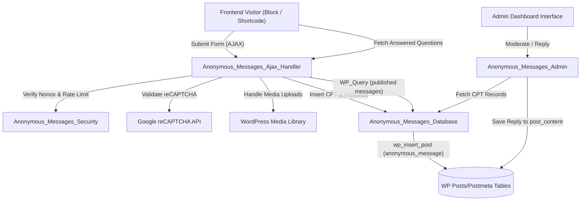

# System Architecture - Anonymous Messages

This document explains the technical architecture of the **Anonymous Messages** plugin (v2.0.0), detailing the components, data modeling, block design, data flow, and Gutenberg integration.

---

## 1. High-Level Data Flow

The following diagram illustrates how frontend submissions, security validation, Custom Post Type storage, and dashboard moderation interact:



---

## 2. Core Class Responsibilities

The plugin follows a modular Object-Oriented design pattern in PHP. The main class bootstrap instantiates singleton-like component controllers.

| Controller Class / File | Design Pattern | Responsibilities |
| :--- | :--- | :--- |
| **[AnonymousMessages](file:///run/media/hadi/SSD2/Coding/AskAnonWP/anonymous-messages.php)** | Singleton | Bootstraps the plugin, registers activation/deactivation hooks, initializes CPT (`anonymous_message`) and Taxonomy (`anonymous_message_category`), and triggers automatic data migrations on update. |
| **[Anonymous_Messages_Database](file:///run/media/hadi/SSD2/Coding/AskAnonWP/includes/class-database.php)** | Singleton | Serves as an abstraction layer for querying and inserting messages. Wraps native WordPress APIs (`wp_insert_post`, `WP_Query`, `wp_set_object_terms`) to retrieve, update, and manage anonymous message posts. |
| **[Anonymous_Messages_Gutenberg_Block](file:///run/media/hadi/SSD2/Coding/AskAnonWP/includes/class-gutenberg-block.php)** | Singleton | Registers the parent Gutenberg block (`anonymous-messages/message-block`) and child blocks. Handles server-side rendering for the dynamic uploader and list components, and registers shortcode fallbacks. |
| **[Anonymous_Messages_Ajax_Handler](file:///run/media/hadi/SSD2/Coding/AskAnonWP/includes/class-ajax-handler.php)** | Singleton | Processes AJAX endpoints (`submit_anonymous_message`, `get_answered_questions`), coordinates reCAPTCHA spam validation, handles media attachments, and schedules asynchronous email alerts. |
| **[Anonymous_Messages_Admin](file:///run/media/hadi/SSD2/Coding/AskAnonWP/includes/class-admin.php)** | Singleton | Configures custom column listings in the native WP post edit table (`edit.php?post_type=anonymous_message`), creates the Reply Meta Box, and handles export filters. |
| **[Anonymous_Messages_Security](file:///run/media/hadi/SSD2/Coding/AskAnonWP/includes/class-security.php)** | Singleton | Manages submission rate limiting (transient IP tracking), honeypot form validations, and XSS input sanitization policies. |
| **[Anonymous_Messages_Migration](file:///run/media/hadi/SSD2/Coding/AskAnonWP/includes/class-migration.php)** | Singleton | Orchestrates one-time data conversion from legacy custom database tables to WordPress native post types, taxonomies, and attachments. |

---

## 3. Data Modeling: Custom Post Types, Taxonomies & Metadata

Instead of utilizing non-standard database tables, the plugin relies entirely on standard WordPress tables (`wp_posts`, `wp_postmeta`, `wp_terms`, `wp_term_relationships`) allowing compatibility with backup, translation, caching, and media offloading systems.

```
                     ┌──────────────────────────────────────┐
                     │          Post: wp_posts              │
                     ├──────────────────────────────────────┤
                     │ ID (PK)                              │◄─────────┐
                     │ post_title (e.g. "Message #123")     │          │
                     │ post_content (Admin's text reply)    │          │
                     │ post_author (Assigned moderator ID)  │          │
                     │ post_status ('pending', 'publish')   │          │
                     │ post_date (Submission date)          │          │
                     └──────────────────────────────────────┘          │
                                       │                               │
                                       ▼ (Metadata Joins)              │
                     ┌──────────────────────────────────────┐          │
                     │       Post Metadata: wp_postmeta     │          │
                     ├──────────────────────────────────────┤          │
                     │ _anonymous_message_text (Raw input)  │          │
                     │ _anonymous_sender_name               │          │
                     │ _is_featured ('1' or '0')            │          │
                     └──────────────────────────────────────┘          │
                                       │                               │
                                       ▼ (Taxonomy Term Joins)         │
 ┌──────────────────────────────────────────────────────────────────┐  │
 │                   Taxonomy Relationships                         │  │
 ├──────────────────────────────────────────────────────────────────┤  │
 │ Term: anonymous_message_category (e.g., "General", "Tech")       │  │
 └──────────────────────────────────────────────────────────────────┘  │
                                                                       │
                                       ┌───────────────────────────────┘
                                       ▼ (Media Attachments)
                     ┌──────────────────────────────────────┐
                     │        Media: wp_posts (attachment)  │
                     ├──────────────────────────────────────┤
                     │ post_parent (Message CPT ID)         │
                     │ guid (File absolute path)            │
                     │ post_mime_type (image/jpeg, etc.)    │
                     └──────────────────────────────────────┘
```

### Model Mapping Details

*   **CPT (`anonymous_message`):** Each visitor submission represents a custom post.
    *   **Question Text:** Stored in the `_anonymous_message_text` post meta key.
    *   **Moderator Response:** Stored inside the native `post_content` field.
    *   **Post Status:**
        *   `pending`: Submission is unapproved or unanswered.
        *   `publish`: Submission has been answered and is visible to the public.
    *   **Author (`post_author`):** Holds the ID of the assigned user.
*   **Taxonomy (`anonymous_message_category`):** Standard hierarchical taxonomy registered for grouping and filtering messages.
*   **Media Attachments:** Uploaded images are created as standard WordPress media attachments linked to the CPT parent post.

---

## 4. Block Editor & InnerBlocks Layout

The Gutenberg block implementation divides the form into modular child blocks nested within a parent block wrapper. This enables users to customize, delete, style, and reorder fields using the block editor.

### Block Hierarchy

*   **Parent Block (`anonymous-messages/message-block`):** Acts as the outer form wrapper. Uses `<InnerBlocks />` with `templateLock={false}` to allow layout adjustments.
    *   **`anonymous-messages/message-textarea` (Static):** Renders the message input field. Supports custom placeholders, row dimensions, colors, borders, and typography spacing.
    *   **`anonymous-messages/image-uploader` (Dynamic):** Renders the image attachment controls. Displays current upload restrictions (allowed extensions, file sizes) dynamically from the plugin settings page.
    *   **`anonymous-messages/submit-button` (Static):** Renders the form submission button and rate-limiting timers. Supports custom colors, borders, and margins.
    *   **`anonymous-messages/questions-list` (Dynamic):** Renders the answered questions area. Retrieves taxonomy category filters and questions dynamically on load via AJAX.

### Frontend Javascript Bindings

The controller in [block-frontend.js](file:///run/media/hadi/SSD2/Coding/AskAnonWP/assets/js/block-frontend.js) handles UI events:
*   Initializes visible widgets (e.g. Google reCAPTCHA v3) inside the container.
*   Manages rate limit cooldown intervals.
*   Handles multi-file selection, validates image sizes/types locally, and updates previews.
*   Intercepts form submit, generates standard `FormData`, appends security nonces, and sends them to the AJAX handler.
*   Binds event listeners to prevent form submissions if a visitor presses Enter inside the list's search field.
